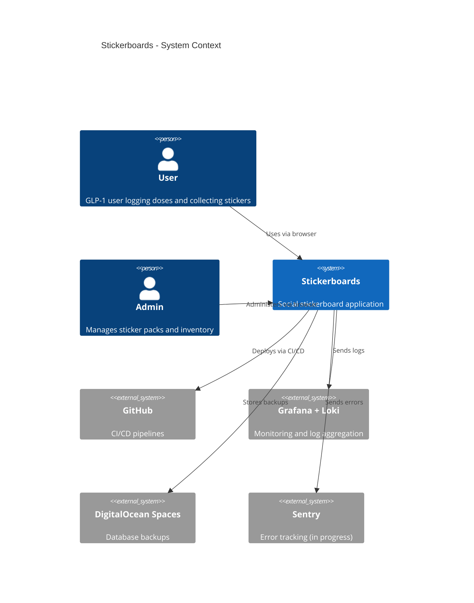
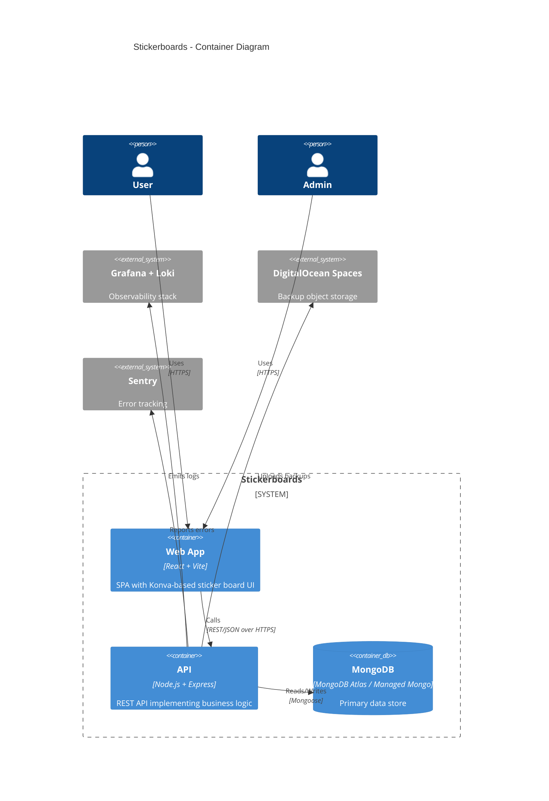
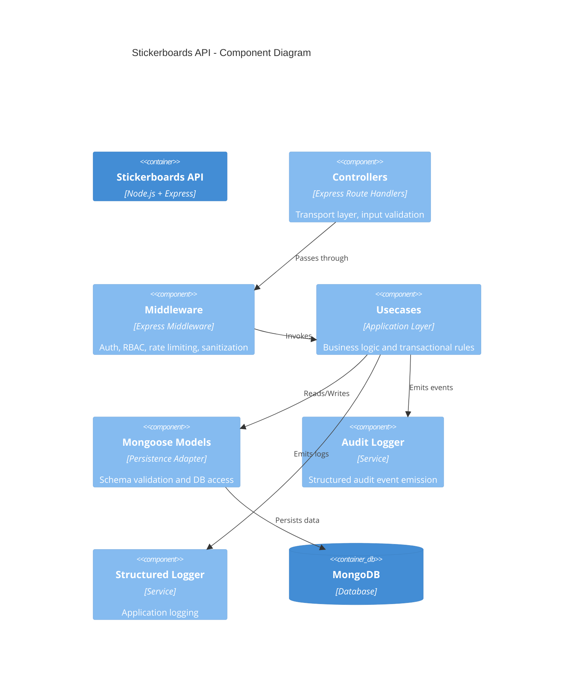

# C4 Architecture Diagrams

This document describes the Stickerboards architecture using the C4 model.

Levels included:
- Level 1 — System Context
- Level 2 — Container Diagram
- Level 3 — Component Diagram (API)

---

# Level 1 — System Context

# Level 2 — Container Diagram

# Level 3 — Component Diagram (API)

** Architectural Notes **

## Invariant Enforcement Layer

Core invariants are enforced inside usecases, including:
-Idempotent sticker transactions (opId)
-MongoDB transactional boundaries
-RBAC enforcement
-Audit emission guarantees
Controllers remain thin and contain no domain logic.

## Known Architectural Tradeoff
Usecases currently import Mongoose models directly.

A strict Hexagonal Architecture would introduce:
-Repository Ports
-Infrastructure Adapters
-Framework-agnostic Domain Entities
This is a known and documented evolution path.

## Future Diagram Extensions
Potential additions:
-Sequence Diagram: Award Sticker Transaction
-Sequence Diagram: Asset Ingestion
-Deployment Diagram (CI → Artifact → PM2)
-Hexagonal Target-State Diagram
